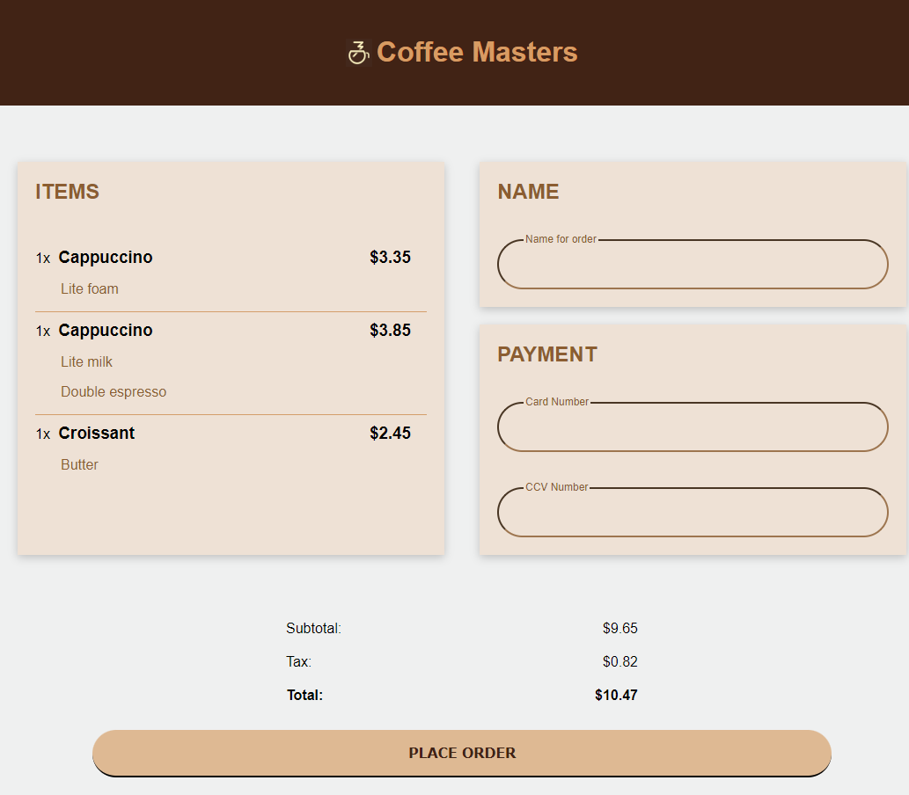

# FRONTEND MASTERS Challenge 1 - CSS

Desafio simples testando a habilidade de alocar elementos na tela com grid

## Link para o desafio:
- https://btholt.github.io/complete-intro-to-web-dev-v3/lessons/css/project

## Link para acesso:
- https://merry-genie-b076f7.netlify.app/

## Preview:
